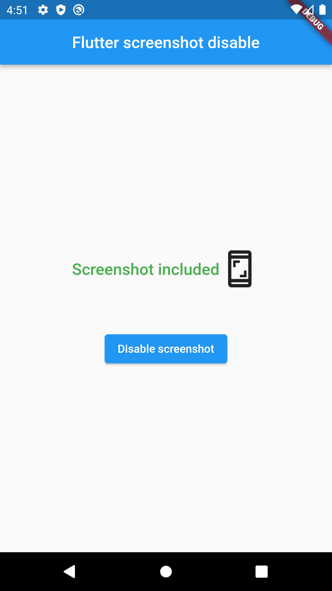

# flutter_screenshot_disable

The package provides an easy way to disable screenshot in a Flutter project.
**(Android only)**

## Getting Started

### Add dependency
```
dependencies:
  flutter_screenshot_disable: 0.0.1 #latest version
```

## How to use

```dart
import 'package:flutter_screenshot_disable/flutter_screenshot_disable.dart';

```

### Demo example



### Example of use
```dart
class ExamplePage extends StatefulWidget {
  const ExamplePage({Key? key}) : super(key: key);

  @override
  State<ExamplePage> createState() => _ExamplePageState();
}

class _ExamplePageState extends State<ExamplePage> {
  bool _disableScreenshot = false;

  @override
  Widget build(BuildContext context) {
    return Scaffold(
      appBar: AppBar(
        title: const Center(child: Text('Flutter screenshot disable')),
      ),
      body: Column(
        mainAxisAlignment: MainAxisAlignment.center,
        children: <Widget>[
          Row(
            mainAxisAlignment: MainAxisAlignment.center,
            children: [
              _disableScreenshot
                  ? const Text(
                'Screenshot disabled',
                style: TextStyle(
                  color: Colors.red,
                  fontSize: 20,
                  fontWeight: FontWeight.w500,
                ),
              )
                  : const Text(
                'Screenshot included',
                style: TextStyle(
                  color: Colors.green,
                  fontSize: 20,
                  fontWeight: FontWeight.w500,
                ),
              ),
              const Icon(Icons.screenshot_outlined, size: 50),
            ],
          ),
          const SizedBox(height: 50),
          ElevatedButton(
              onPressed: () async {
                bool flag = !_disableScreenshot;
                // Disable or allow screenshots
                await FlutterScreenshotDisable.disableScreenshot(flag);
                setState(() {
                  _disableScreenshot = flag;
                });
              },
              child: Text(_disableScreenshot ? "Allow screenshot" : "Disable screenshot")),
        ],
      ),
    );
  }
}
```
